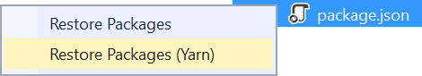
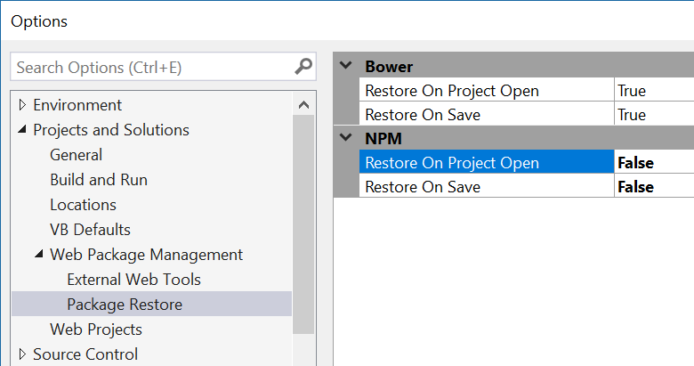

# Yarn Installer

<!-- Update the VS Gallery link after you upload the VSIX-->
Download this extension from the [VS Gallery](https://visualstudiogallery.msdn.microsoft.com/[GuidFromGallery])
or get the [CI build](http://vsixgallery.com/extension/54ec7bf0-19bb-467f-a5a5-15ad0492653b/).

---------------------------------------

Makes it easy to restore npm packages using Yarn from within Visual Studio

See the [change log](CHANGELOG.md) for changes and road map.

## Prerequisite
You need to install [Yarn](https://yarnpkg.com/) in order for this extension to work.

## Restore packages using Yarn
Right-click *package.json* in any web project to see the command for restoring using Yarn.

## Disable npm restore
By default Visual Studio will call `npm install` when *package.json* is saved and also when a project containing a *package.json* file is being opened.

To turn off the automatic calls to `npm install`, disable them in the **Tools -> Options** dialog.

## Contribute
Check out the [contribution guidelines](.github/CONTRIBUTING.md)
if you want to contribute to this project.

For cloning and building this project yourself, make sure
to install the
[Extensibility Tools](https://visualstudiogallery.msdn.microsoft.com/ab39a092-1343-46e2-b0f1-6a3f91155aa6)
extension for Visual Studio which enables some features
used by this project.

## License
[Apache 2.0](LICENSE)